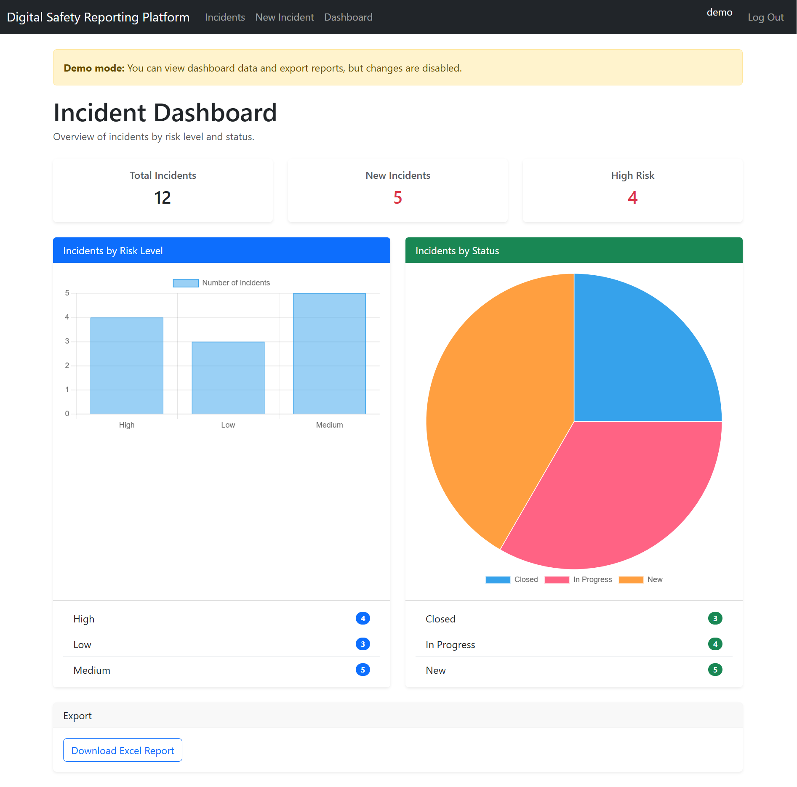
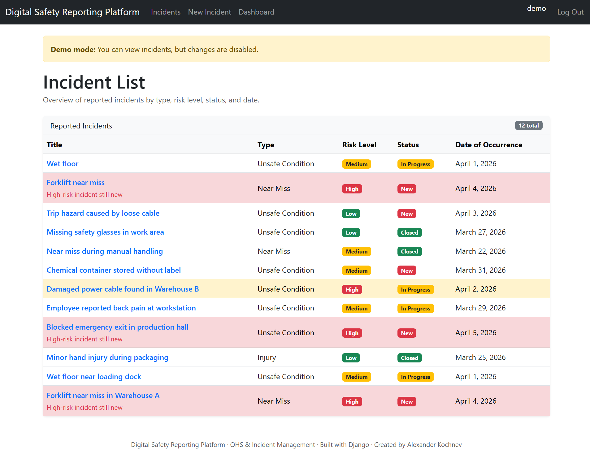
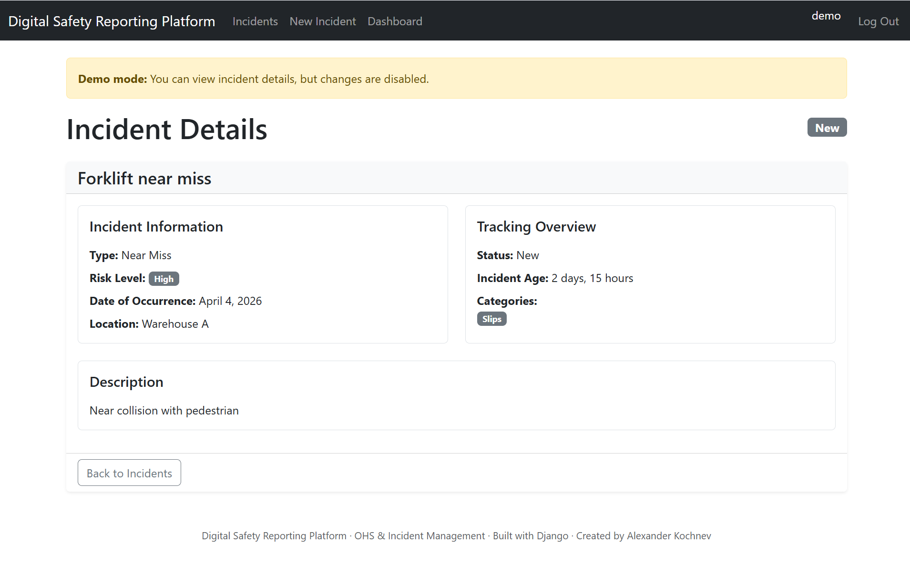
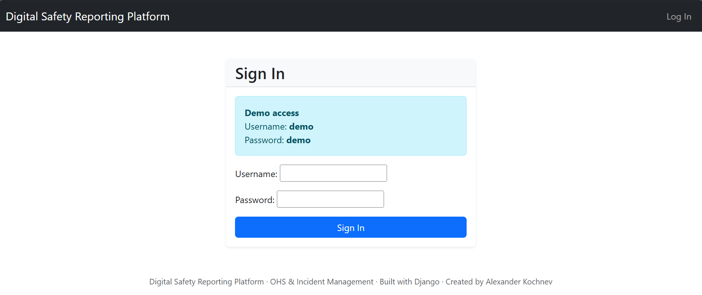
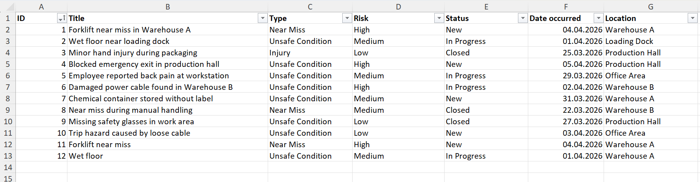

# Digital Safety Reporting Platform (Kochnev A)

## Description
Web application for reporting and managing safety incidents (near-miss events, workplace injuries, hazardous situations).

The goal of this project is to provide a structured and centralized way to capture safety-related data and support better visibility and analysis.

---

## Tech Stack
- Python (Django)
- PostgreSQL
- Django REST Framework
- pytest
- openpyxl

---

## Features
- Incident reporting via web form
- Role-based access (Employee / Safety Manager)
- Incident detail view and status management
- Dashboard with basic safety statistics
- REST API for integration (JSON)
- Export incidents to Excel
- Automated tests with pytest

---

## Tech Stack

- Python (Django)
- PostgreSQL
- Django REST Framework
- Chart.js
- Bootstrap
- pytest
- openpyxl

---

## Screenshots

### Dashboard


### Incident List


### Incident Detail


### Sign In


### Export Excel Report


---

## Data Model
The application includes multiple related models:
- EmployeeProfile (user roles)
- Incident
- Location
- IncidentCategory
- CorrectiveAction

Relations:
- One-to-many (Location → Incident)
- Many-to-many (Incident ↔ Categories)

---

## How to Run Locally

1. Clone repository:
```bash
git clone https://github.com/AlexandrosPRG/Digital_Safety_Reporting_Platform_Kochnev_A
git cd Digital_Safety_Reporting_Platform_Kochnev_A
```

2. Create virtual environment
```bash
python -m venv .venv
.venv\Scripts\activate
```

3. Install dependencies
```bash
pip install -r requirements.txt
```
4. Apply migrations
```bash
python manage.py migrate
```
5. Create superuser (optional)
```bash
python manage.py createsuperuser
```
6. Run development server
```bash
python manage.py runserver
```
Application will be available at:
```bash
http://127.0.0.1:8000/
```
7. Testing
Run tests with pytest:
```bash
pytest
```
---
## Demo

Demo mode available (read-only access).

---
## Example Use Case
- Employee logs in and reports a near-miss incident
- Incident is stored with structured data (risk, category, location, date)
- Safety Manager reviews the incident and updates status
- Data is visible in dashboard and can be exported to Excel
  
---
## Notes
- This project is a simplified prototype created for learning purposes
- It does not contain any real company or confidential data
- Designed to demonstrate backend development and basic OHS digitalization concepts

---
## Author
Alexander Kochnev
